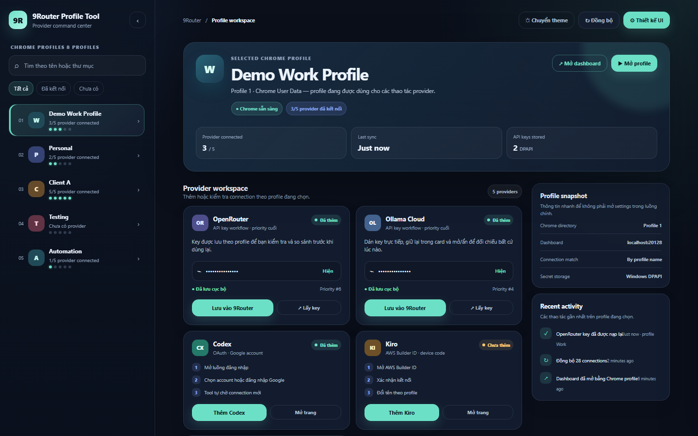

# RouterPlus User Guide

RouterPlus giúp mở Chrome profile đúng ngữ cảnh và quản lý connection/provider trong 9Router.



> Ảnh trên chỉ dùng dữ liệu demo. Không dùng email, đường dẫn Chrome hoặc API key thật trong issue, screenshot hay log.

## 1. Yêu cầu

- Windows x64.
- Chrome hoặc Chromium đã cài trên máy.
- 9Router đang chạy nếu bạn muốn đồng bộ hoặc mở dashboard.
- Bản phát hành self-contained không yêu cầu cài .NET 8 Runtime.

## 2. Tải và chạy lần đầu

1. Mở [Latest Releases](https://github.com/hieuck/9router-plus/releases/latest).
2. Tải file `RouterPlus-vX.Y.Z-win-x64.zip`.
3. Tùy chọn: tải file `.sha256` cạnh zip và kiểm tra checksum bằng PowerShell:

   ```powershell
   $archive = '.\RouterPlus-vX.Y.Z-win-x64.zip'
   $expected = (Get-Content '.\RouterPlus-vX.Y.Z-win-x64.zip.sha256').Split()[0]
   $actual = (Get-FileHash $archive -Algorithm SHA256).Hash.ToLowerInvariant()
   if ($actual -ne $expected) { throw 'Checksum không khớp.' }
   'Checksum hợp lệ.'
   ```

4. Giải nén vào thư mục bạn muốn giữ ứng dụng.
5. Mở `RouterPlus.exe`.
6. Nếu Windows SmartScreen cảnh báo, chỉ tiếp tục khi bạn đã tải đúng asset từ release chính thức và checksum hợp lệ. Personal release và build local có thể chưa được code-sign bởi CA; đây là hành vi dự kiến cho bản cá nhân.

## 3. Thiết lập lần đầu

1. Nhấn `⚙ Cài đặt`.
2. Ở `Chrome executable`, chọn đúng file `chrome.exe`.
3. Ở `Chrome User Data`, chọn thư mục User Data của Chrome/Chromium, không chọn thư mục `Profile 1` riêng lẻ.
4. Kiểm tra `Dashboard URL`; mặc định là `http://localhost:20128`.
5. Nhấn `Lưu cài đặt`.
6. Chọn một profile trong danh sách. Khi đọc thành công, app hiển thị trạng thái Chrome và danh sách provider.

Nếu Chrome được cài ở vị trí chuẩn, app sẽ tự thử tìm executable và User Data. Bạn vẫn có thể chọn lại thủ công trong settings.

## 4. Quản lý Chrome profile

### Chọn và tìm profile

- Chọn profile ở thanh bên để làm profile hiện hành.
- Dùng ô tìm kiếm theo tên hoặc thư mục.
- Chọn bộ lọc trạng thái nếu cần tìm profile đã có provider, chưa có provider hoặc đang kết nối.

### Tạo profile do RouterPlus quản lý

1. Nhập tên chưa có vào ô tìm kiếm.
2. Chọn thao tác thêm profile mới.
3. Xác nhận tên profile.
4. App tạo mapping riêng và cấp thư mục profile tương ứng.
5. Chọn profile mới để tiếp tục thêm provider.

### Mở dashboard

- Nháy đúp profile hoặc nhấn `Mở dashboard`.
- App mở dashboard bằng đúng Chrome profile đã chọn.
- Nếu dashboard không mở, kiểm tra 9Router đang chạy và URL trong settings.

### Context menu

Nhấp chuột phải profile để:

- đăng nhập Google bằng đúng Chrome profile;
- mở thư mục profile;
- sao chép tên profile;
- xóa profile sau khi xác nhận.

Xóa profile chỉ xóa thư mục profile được chọn; không xóa toàn bộ Chrome User Data. Hãy đóng Chrome trước khi xóa để tránh file đang được khóa.

## 5. Đồng bộ và đọc trạng thái

1. Nhấn `Đồng bộ` để đọc connection từ 9Router.
2. Mỗi profile hiển thị badge provider tương ứng.
3. Connection được match theo tên profile.
4. Nếu connection cũ chưa được đổi tên theo profile, app có thể không nhận diện đúng. Đổi tên connection trong 9Router rồi đồng bộ lại.

## 6. Thêm provider OAuth/device code

### Codex

1. Chọn profile.
2. Nhấn `Thêm` ở card Codex.
3. App mở luồng đăng nhập trong Chrome profile hiện hành.
4. Hoàn tất đăng nhập và xác nhận trên trang provider.
5. Quay lại app; app chờ connection mới và đổi tên theo profile.

### Kiro

1. Chọn profile.
2. Nhấn `Thêm` ở card Kiro.
3. Mở trang device code theo hướng dẫn trong trình duyệt.
4. Nhập/xác nhận code trên trang provider.
5. Chờ app nhận connection mới và đồng bộ tên profile.

### Kimchi

1. Chọn profile.
2. Nhấn `Thêm` ở card Kimchi.
3. Hoàn tất OAuth trong Chrome.
4. Quay lại app để app nhận và đổi tên connection.

Nếu OAuth/device code timeout, không tạo lại liên tục; xem [Troubleshooting](troubleshooting.md), kiểm tra Chrome profile và thử lại sau khi đóng luồng cũ.

## 7. Thêm OpenRouter/Ollama bằng API key

1. Chọn profile trước khi nhập key.
2. Dán key vào card provider tương ứng hoặc dùng nút `Paste`.
3. Kiểm tra trạng thái hiển thị `Đã lưu cục bộ`/`DPAPI`.
4. Nhấn `Thêm vào 9Router`.
5. App đặt tên connection theo profile, đặt priority ở cuối danh sách và tự chạy Test Connection để đồng bộ trạng thái.
6. Nếu key hợp lệ, card chuyển sang `Online`; nếu kiểm tra thất bại, card hiển thị lỗi thay vì báo Online giả.
7. Ô key không tự xóa để bạn có thể đối chiếu; key vẫn được mask. Chỉ nhấn `Hiện key` khi cần kiểm tra trên máy riêng.

Không gửi API key vào issue, chat, screenshot, clipboard log hoặc file backup không mã hóa. Chi tiết lưu trữ xem [Privacy](privacy.md).

## 8. About, Help và tự cập nhật

- Mở menu `Trợ giúp` để xem `Giới thiệu`, hướng dẫn, chính sách bảo mật hoặc trang release cố định của dự án. About chỉ hiển thị tên app, version, MIT License và link công khai; không bind vào profile, log, settings hay secret.
- Chọn `Kiểm tra cập nhật` để đọc release stable từ repository cố định. Request này không gửi profile, email, API key, OAuth state, Chrome path hoặc machine identifier.
- Nếu có bản mới, app chỉ cho cài khi executable hiện tại và package mới được xác minh bằng Authenticode, manifest signature, checksum và archive layout. Người dùng phải xác nhận trước khi app đóng.
- Build unsigned, personal release hoặc release thiếu chữ ký sẽ hiển thị self-update bị vô hiệu hóa; không có fallback tải executable từ URL tùy ý.
- Updater riêng đổi live directory sang backup, đưa staging vào vị trí live và rollback nếu bản mới không khởi động được. Settings và DPAPI secrets nằm ngoài package update.
## 9. Theme, font và settings

- Nhấn `⚙ Cài đặt` để mở/thu gọn settings.
- Chọn theme sáng/tối.
- Chọn font scale phù hợp màn hình.
- Nhấn `Lưu cài đặt` sau khi đổi đường dẫn hoặc dashboard URL.
- Vị trí cửa sổ được lưu khi đóng app và áp dụng lại lần sau nếu còn hợp lệ.

## 10. Dữ liệu cục bộ và chuyển máy

RouterPlus lưu:

- `%LOCALAPPDATA%\9RouterPlus\settings.json`: đường dẫn, dashboard URL, mapping profile và tùy chọn giao diện.
- `%LOCALAPPDATA%\9RouterPlus\secrets.json`: API key đã mã hóa bằng DPAPI cho Windows user hiện tại.

Khi chuyển sang Windows user khác, `secrets.json` không tự giải mã được. Nếu cần chuyển máy, hãy tạo key mới trên user đích thay vì copy secrets như file văn bản thông thường.

## 11. Gỡ ứng dụng

1. Đóng RouterPlus và Chrome.
2. Xóa thư mục đã giải nén của RouterPlus.
3. Nếu muốn giữ settings/key cho lần cài sau, giữ lại `%LOCALAPPDATA%\9RouterPlus`.
4. Nếu muốn xóa toàn bộ dữ liệu local, xóa thư mục `%LOCALAPPDATA%\9RouterPlus`; thao tác này sẽ xóa mapping, cài đặt và key đã lưu.
5. Chrome User Data và profile Chrome không bị xóa khi gỡ RouterPlus.

## Tài liệu liên quan

- [Privacy và dữ liệu](privacy.md)
- [Troubleshooting](troubleshooting.md)
- [Security policy](../SECURITY.md)
- [Changelog](../CHANGELOG.md)
